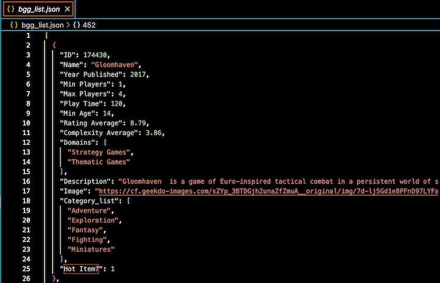
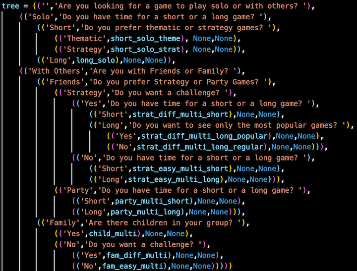

# SI507 Final Project Submission

### Github Repo
[mleighc/SI507-FinalProject](https://github.com/mleighc/SI507-FinalProject.git)           

### Project Code
**Packages**:             
> requests   
> xmltodict    
> webbrowser   
     
## README
**Files**:                  
* **Final_Proj_API.py**
> Python File with code for accessing Board Game Geek's API and reading the data from XML to json in order to clean and parse the data. Then, the json objects are written to a json file.

* **bgg_list.json**
> The final file created by the code in Final_Proj_API.py.

* **hot_boardgames.json**
> Test json file used as initial example for figuring our the process of writing xmltodict and then saving that dict to json.

* **Final_Proj_Tree.py**
> Code for reading in the bgg_list.json file, parsing the data based on the outline of the tree structure and user question/answer flow, then loading that data into the tree structure. This file also include the control flow for interacting with the user and displaying necessary game information based on their answers to the computer's questions.

**Description of the Program**:      
     
First, I began by accessing about 20k board game records from a combination of xml data accessed via Board Game Geek's (BGG) API, along with a Kaggle csv of additional board game attribute data scraped from BGG by another user. Using the xmltodict package, I was able to parse the xml data and save it to a python dictionary. From there, I enhanced the dictionary objects with additional board game attributes from the Kaggle csv and saved a selected subset of the records (about 500) to a json file.

After getting a better understanding of the data, I was able to think through various methods of categorizing the data (i.e. solo vs. multiplayer games, short vs. long play time, family vs. party games, etc.) in order to create a tree of questions to be asked of the user. These user questions would allow the computer to filter through the subset of the ~20k board game objects and recommend the right list for the user. From there, the user can access details from individual records to make their final selection. I used a subset of data for ease of processing on my limited computer memory, but I believe a larger subset could be worked through and loaded, as well as the addition of more subquestions to shorten the result lists that are returned.

### Data Sources
* [BoardGameGeek XML API2](https://boardgamegeek.com/wiki/page/BGG_XML_API2)       
    * 20k+ records available
    * Retrieved about 500
    * API Data is in XML format
    * Accessed data using *requests* and *xmltodict* modules
    * Enhanced original dictionary with additional attributes from below Kaggle csv
    * Cleaned and saved the dictionary to a json file to be read into Final_Proj_Tree.py file
* [Kaggle Dataset of Board Game Attributes](https://www.kaggle.com/datasets/andrewmvd/board-games)        
    * 20k+ records
    * csv of game attributes also accessed from Board Game Geek's website  
    * Read csv into Final_Proj_Tree.py
    * Used additional attributes to enhance dictionaries that represent games

### Key Fields from Combined Data
* *ID* - primary key or reference number; integer
* *Name* - Game Title; string
* *Year Published* - Year of publication; integer
* *Min Players* - Minimum # of players needed; integer
* *Max Players* - Maximum # of players needed; integer
* *Play Time* - Length of time to play; integer
* *Min Age* - Minimum age to play; integer
* *Rating Average* - average rating; float
* *Complexity Average* - average complexity i.e. is it challenging?; float
* *Domains* - Type of Game; list
* *Categories* - Game category or topic; list
* *Hot Item?* - field created by me based on pulling from the HOT item list via API, which indicated most popular games at the time; boolean

### More Info on BGG Data
* [Diving into BoardGameGeek](https://jvanelteren.github.io/blog/2022/01/19/boardgames.html).   
    * Article with insights on BGG's ratings just for some research/context
* [BoardGameGeek Data Dictionary on Ratings](https://boardgamegeek.com/wiki/page/ratings)      
    * Additional context and details on the rating system on BGG's website.
* [BoardGameGeek API Terms of Use](https://boardgamegeek.com/wiki/page/XML_API_Terms_of_Use#)       
    * This is a link to BGG's Terms of Service for the data for my reference.

### Data Structure
The board game data, along with a series of categorical (this or that, yes or no) questions, were saved into a tree structure. The tree is formatted as triples or tuples of 3 tuples. I used a json file as an intermediate cache to save the API/XML data before reading the json file into my Final_Project_Tree.py file for manipulation and parsing. The "filtered" results are stored as a list of dictionaries and saved in the last leaf of each subTree to be accessed by the _display_list_ and _pick_game_ functions.     
       
**JSON Cache**      
     
       
**Tree Structure**       
           
       
    

### Interaction and Presentation
The user will initiate the python script on the command line (`python3 Final_Proj_Tree.py`). They will first see a welcome message that gives them brief instructions on how to interact with the program (`Welcome to the Board Game Recommender! I will ask you a series of questions in order to get to know you better. With this information, I can make recommendations on your next awesome board game experience! Let's Begin:`).        
    
The root of the tree is the very first categorical question (`Are you looking for a game to play solo or with others?`), which bisects the board game data based on Max Player numbers. From there, they continue to answer a series of questions until the final Result Leaf is reached and a final filtered list of game dictionaries is pretty printed to the screen with its `ID` and `Name`. The user is asked to select one of the games by its `ID` in order to view the game's description, as well as access its cover image url in a web browser. Once that information is displayed to the user, they are prompted to decide whether they'd like to view the details of another game or `Exit` the program.        
      
If another `ID` is entered, the program will contnue to display the information and prompt the user to enter a new `ID`. If `Exit` is entered, the user is prompted to decide whether they'd like to begin the question/answer process from the top or end the program completely.

### Demo Video
[Zoom Demo Video Link](https://umich.zoom.us/rec/share/OGETAzEnmMxGr9eMeZhQzdkCMLGGwpfEd1QzK6u6yny1Ek9X3CN2SVpO-g7aN_Kv.TF_H8uqVGdlNQmPw?startTime=1651246986000)       
